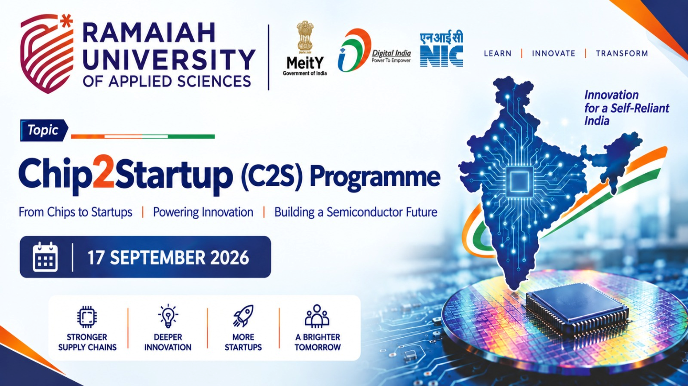

# Chip2Startup (C2S) Programme — Interactive Technology Showcase



**Ramaiah University of Applied Sciences**  
**Chip2Startup (C2S) Programme** · 17 September 2026  

*From Chips to Startups | Powering Innovation | Building a Semiconductor Future*  
*Innovation for a Self-Reliant India · LEARN | INNOVATE | TRANSFORM*

Supported under the national semiconductor / digital India ecosystem (MeitY · Digital India · NIC).

---

## Live demo

**https://semiconruas.netlify.app/**

---

## What this is

A **fullscreen continuous demo** that presents indigenous semiconductor, AR, AI, and medical-device work from RUAS in one looping showcase — built for live projection and kiosk display.

Open the [live site](https://semiconruas.netlify.app/) or **`index.html`** and the presentation starts automatically.

---

## Showcase sequence

The demo loops forever in this order:

| # | Project | File |
|---|---------|------|
| 01 | Chip2Startup AR Learning Platform | `arbased.html` |
| 02 | AR Chip Design Explorer | `chipdesignbypass.html` |
| 03 | RUAS Smart Campus | `arsmartcampus.html` |
| 04 | RUAS AR Drone Platform | `ardrone.html` |
| 05 | VenoClot Device Inspection | `venoclot-w-heater.html` |
| 06 | Showcase video (0.5× speed) | `InShot_20260916_164134127.mp4` |

After project 06, it returns to project 01 and continues.

---

## Controls

| Action | How |
|--------|-----|
| Jump to a project | Bottom buttons **01 · 02 · 03 · 04 · 05 · VID** (or keys `1`–`6`) |
| Play / Pause | Buttons or `Space` |
| Stop (keep current project on screen) | Button or `Esc` |
| Restart from project 01 | **↻ Restart** |
| Previous / Next | `←` `→` |
| Fullscreen | **⛶** or `F` |

Hover the **right edge** of the screen to reveal the control panel.

---

## Run locally

1. Open the project folder in a terminal.
2. Serve the folder:

```bash
python -m http.server 8765
```

3. Visit http://127.0.0.1:8765/

---

## Project layout

```
├── index.html              ← presentation entry
├── demo-loop.html          ← redirects to index.html
├── demo-loop.css
├── demo-loop.js
├── image.png               ← RUAS logo (intro + corner)
├── c2s-banner.png          ← C2S programme banner
├── arbased.html
├── chipdesignbypass.html
├── arsmartcampus.html
├── ardrone.html
├── venoclot-w-heater.html
└── InShot_20260916_164134127.mp4
```

The AR demos and VenoClot are **standalone** pages. The launcher loads them in iframes without rewriting their Three.js / GSAP scenes.

---

## Notes

- Prefer **Chrome** or **Edge** for WebGL performance.
- An internet connection is needed the first time for CDN libraries used by the demos (Three.js, GSAP).
- The closing video plays **muted**, **looped**, and at **0.5×** speed so it reads well on a large screen.

---

© Ramaiah University of Applied Sciences · Chip2Startup (C2S) Programme